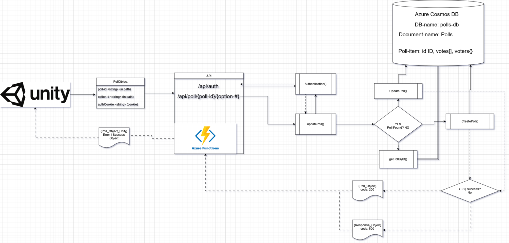

# vrchat-polls Azure Functions

Azure Functions for VRChat Polls Prefab.

VRChat Prefab:

- [https://oikki.gumroad.com/l/pollSystem](https://oikki.gumroad.com/l/pollSystem)
- [https://oikki.booth.pm/items/4956684](https://oikki.booth.pm/items/4956684)

## Required VSCode Extensions:

- Azure Tools
- Azure Functions

## Functions

Production: vrchat-polls

Development: vrchat-polls-dev (not made yet)

## Deployment to Existing Azure Project

1. Click Azure Extension and Login to your Azure account
2. Select `<your_subscription> -> Function App`
3. Right-click `<your_function_app> -> Deploy to Function App... -> Deploy`

## Local Development (Functions)

1. Press `F5` or `Run -> Start Debugging`
2. Connect to storage account
3. Console has local addresses for Functions

## Azure Plan

